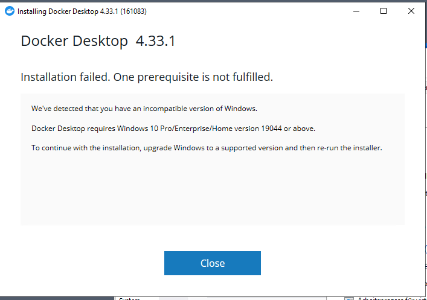

# Homelab setup notes

I have a number of old PCs and laptops that were sitting around, so I decided to start a home lab as an opportunity to learn different technologies and maybe develop something useful at the end. 
One solution was to put a linux distro to every one of those computers but since I'm interested in learning new things, among which is inter-networking across different OSes I decided to go with the OS of each computer and then if I'm fed up I'll switch to linux. 

## Windows 10 202H

First, Is started with an old Windows 10 PC. I want to install Doocker and Kubernetes on it, so I first downloaded [Docker Desktop](https://docs.docker.com/get-started/introduction/get-docker-desktop/).

My first attempt in installing Docker Desktop was unsuccessful because it requires a newer version of Windows 10:

All my attempts to update the Windows Build through the Windows Update feature were unsuccessful, even though I could see the update being available. Fortunately, I found [this page](https://onlinecomputertips.com/support-categories/windows/update-windows10-version-22h2/) on how to update it using Windows 10 Update Assistant which can be downloaded from the Microsoft [website](https://www.microsoft.com/en-us/software-download/windows10).
